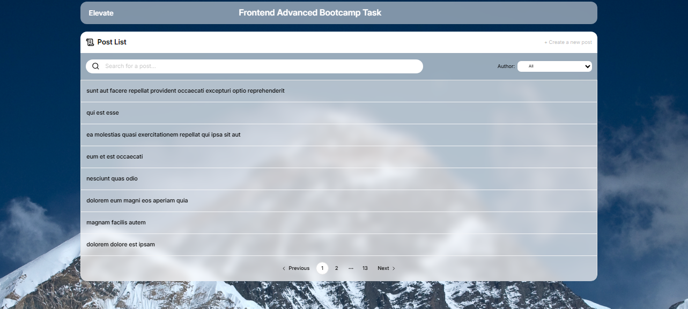
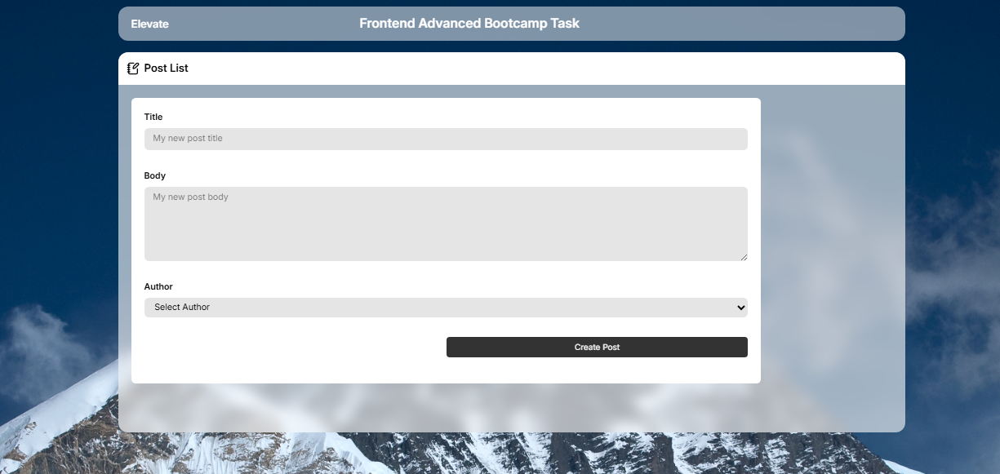
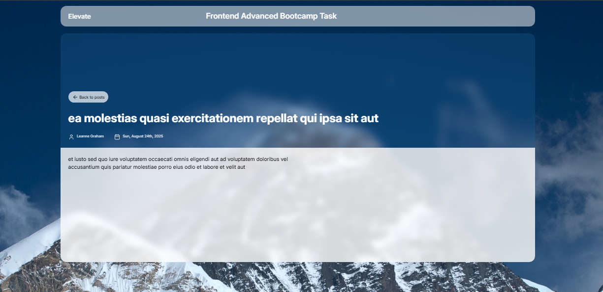

# Post Style App

A modern React application for browsing, filtering, and viewing posts with a clean UI inspired by glassmorphism design.

The app allows users to:

- Browse posts with pagination
- Filter posts by author
- View detailed post information
- Navigate between pages using React Router
- Experience a responsive modern UI

---

# 🚀 Live Demo

🔗 Live Preview: [Post App](https://post-app-steel-two.vercel.app/)

---

# 📸 Preview

## Home Page



## Posts Filtering



## Post Details



---

# 🛠️ Built With

- React 19
- Vite
- React Router DOM
- Tailwind CSS v4
- shadcn/ui
- Lucide React
- React Hook Form
- Zod

---

# 📂 Project Structure

```bash
src
│
├── assets
├── components
│   ├── AllPosts.jsx
│   ├── Form.jsx
│   ├── Header.jsx
│   ├── InputContainer.jsx
│   ├── Logo.jsx
│   ├── Post.jsx
│   ├── SearchBar.jsx
│   └── SuccessMsg.jsx
│
├── hooks
│   └── usePost.js
│
├── pages
│
├── styles
│
├── App.jsx
├── main.jsx
└── index.css
```

# ⚙️ Installation

Clone the repository:

```bash
git clone https://github.com/BahaaMedhat1/Post-App.git
```

Move to the project folder:

```bash
cd post-style-app
```

Install dependencies:

```bash
npm install
```

---

# ▶️ Run Locally

Start the development server:

```bash
npm run dev
```

Then open:

```bash
http://localhost:5173
```

---

# 📦 Available Scripts

Run development server:

```bash
npm run dev
```

Build for production:

```bash
npm run build
```

Preview production build:

```bash
npm run preview
```

Run ESLint:

```bash
npm run lint
```

---

# ✨ Features

- Dynamic posts rendering
- Author filtering
- Client-side pagination
- Dynamic routing with React Router
- Responsive glassmorphism UI
- Reusable components
- Clean folder structure

---

# 🔮 Future Improvements

- Add search functionality
- Add loading skeletons
- Add dark mode
- Add animations
- Server-side pagination
- Better error handling

---

# 👨‍💻 Author

Developed by Bahaa Medhat
